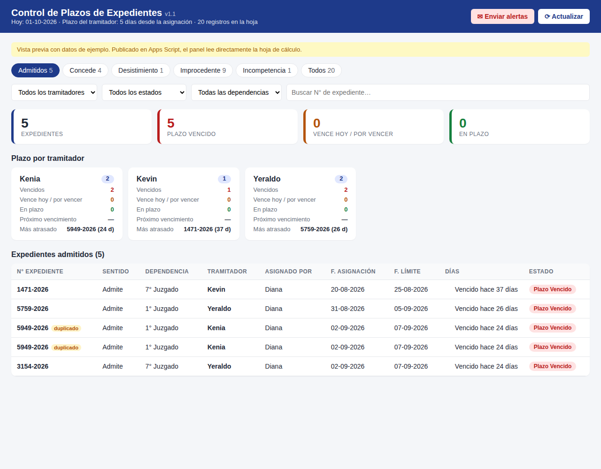
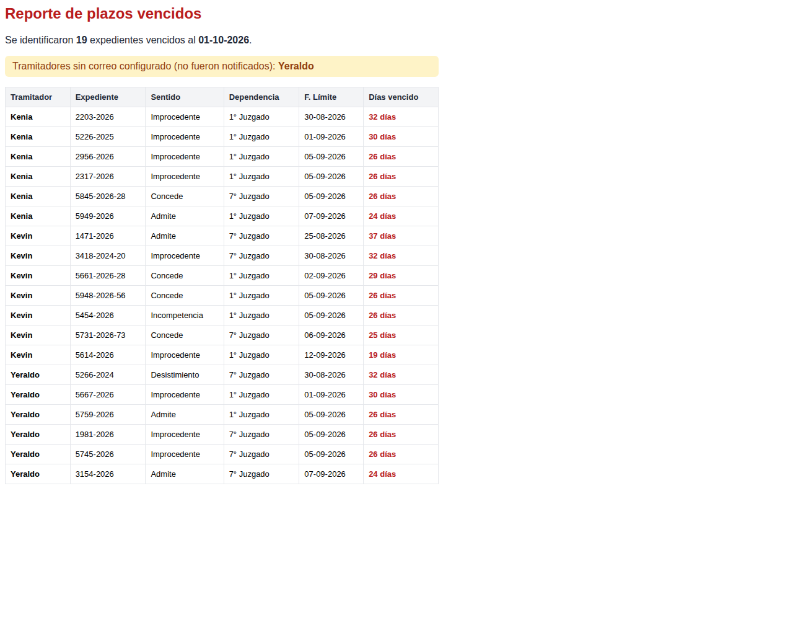

# Control de Plazos de Expedientes (Google Apps Script) – v1.1

Aplicativo web que lee la hoja de Google Sheets con los expedientes y muestra
**los expedientes admitidos y el plazo que tiene cada tramitador** (SECRETARIO).



## Archivos

| Archivo | Para qué sirve |
|---|---|
| `Code.gs` | Lee la hoja, calcula fecha límite, días restantes y estado. Agrega el menú *Control de Plazos* en la hoja. |
| `Index.html` | Panel web: pestañas por sentido (Admitidos por defecto), filtros, resumen por tramitador y tabla. |
| `appsscript.json` | Manifiesto del proyecto (zona horaria America/Lima). |
| `datos_ejemplo.tsv` | Los datos de ejemplo para pegar en la hoja. |

## Estructura de la hoja (fila 1 = encabezados)

| A | B | C | D | E | F | G | H |
|---|---|---|---|---|---|---|---|
| SecretarioInicial | Nro. Expediente | Sentido | Dependencia | Fecha de Asignacion | SECRETARIO | Fecha Limite | Estado |

Las columnas G y H pueden estar sin encabezado: el script las detecta igual.
Si falta la fecha límite se calcula como **Fecha de Asignacion + 5 días**.

## Instalación (5 minutos)

1. Abra su Google Sheets con los datos (puede pegar `datos_ejemplo.tsv`).
2. Menú **Extensiones → Apps Script**.
3. Reemplace el contenido de `Código.gs` por el de `Code.gs`.
4. **Archivo + → HTML**, nómbrelo `Index` y pegue el contenido de `Index.html`.
5. (Opcional) En *Configuración del proyecto* marque "Mostrar archivo de manifiesto"
   y pegue `appsscript.json`.
6. Guarde. Ejecute una vez `obtenerExpedientes` para autorizar los permisos.
7. **Implementar → Nueva implementación → Aplicación web**
   - Ejecutar como: *Yo*
   - Quién tiene acceso: *Solo yo* / *Cualquier usuario de su dominio* / *Cualquier usuario*
8. Abra la URL que le da Google: ese es el aplicativo.

Al recargar la hoja aparece el menú **Control de Plazos**:
- *Actualizar fecha límite y estado*: escribe G y H con el estado según la fecha de hoy.
- *Abrir panel*: abre el aplicativo dentro de la misma hoja.

- *Enviar alertas de vencidos por correo*: envía las alertas (pide confirmación).

Para que cada mañana a las 7 a.m. se actualice la hoja **y se envíen las alertas**,
ejecute una vez `crearActivadorDiario`.

## Alertas por correo (novedad v1.1)

- Cada tramitador recibe **un solo correo** con la tabla de todos sus expedientes vencidos
  (no un correo por fila).
- El supervisor recibe un **reporte general** con todos los vencidos, y un aviso de los
  tramitadores que no tienen correo configurado.
- Un expediente duplicado en la hoja se informa una sola vez.
- Se pueden enviar desde el botón **✉ Enviar alertas** del panel, desde el menú de la hoja
  o automáticamente con la rutina diaria (`ejecutarRutinaDiaria`).
- Antes de enviar revisa la cuota diaria de correos de Google.

Configure los correos al inicio de `Code.gs` (vacío = no se envía):

```js
CORREO_SUPERVISOR: 'supervisor@su-dominio.com',
CORREOS_TRAMITADORES: {
  'kenia': 'kenia@su-dominio.com',
  'kevin': 'kevin@su-dominio.com',
  'yeraldo': 'yeraldo@su-dominio.com'
},
```

La clave es el nombre del tramitador **en minúsculas** tal como figura en la columna SECRETARIO.
La primera vez Google pedirá un permiso nuevo para **enviar correos en su nombre**: acéptelo.



## Historial de versiones

- **1.1** – Alertas por correo de expedientes vencidos (por tramitador y al supervisor),
  botón en el panel, opción en el menú y rutina diaria automática.
- **1.0** – Panel de expedientes admitidos y plazo por tramitador.

## Configuración (inicio de `Code.gs`)

```js
NOMBRE_HOJA: '',   // pestaña con los datos ('' = la primera)
ID_HOJA: '',       // solo si el script no está dentro de la hoja
PLAZO_DIAS: 5,     // días que tiene el tramitador
ALERTA_DIAS: 2,    // "Por vencer" cuando faltan 2 días o menos
```

## Reglas del panel

- **Estado**: *Plazo Vencido* (días < 0), *Vence hoy*, *Por vencer* (≤ 2 días), *En plazo*.
- Normaliza datos escritos de forma distinta: `kenia`/`Kenia`, `1ro`/`1ero` → `1° Juzgado`,
  `Admite ` con espacio, `conceede` → `Concede`.
- Marca como **duplicado** el expediente registrado dos veces con el mismo sentido
  (en los datos de ejemplo: `5949-2026`, Admite, filas 2 y 19).
- Clic en la tarjeta de un tramitador filtra la tabla; clic en un encabezado ordena.

Abrir `Index.html` directamente en el navegador muestra una vista previa con los datos de ejemplo.
